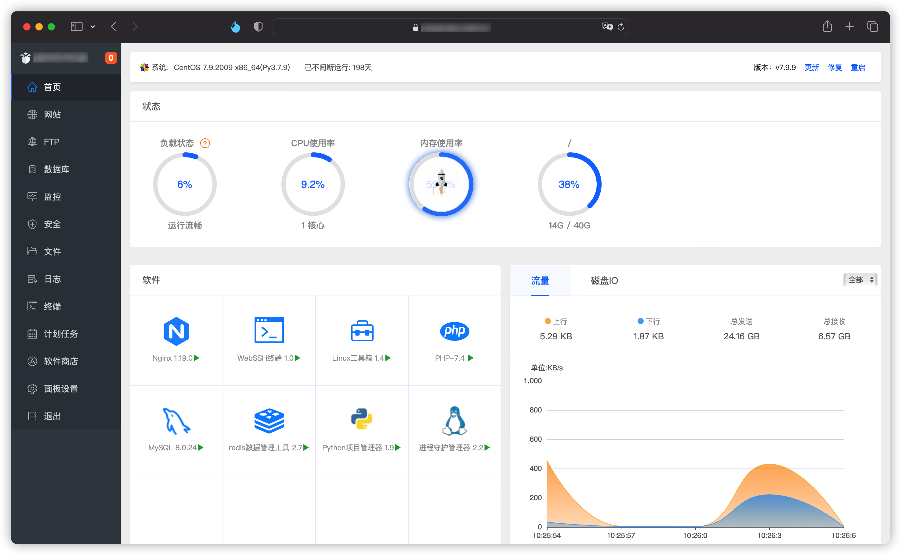
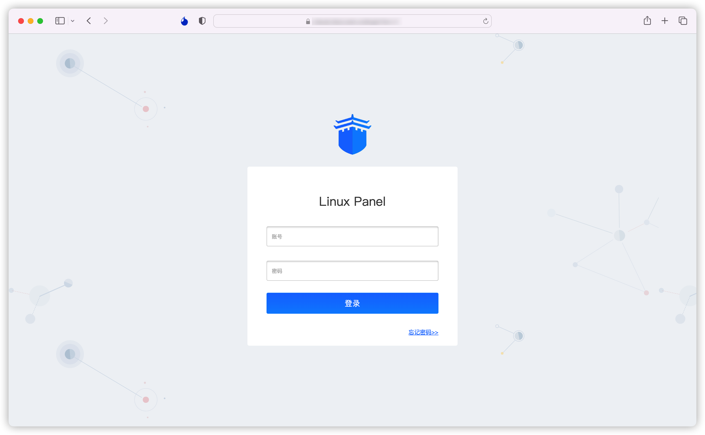

 <h1>BTPanel Theme</h1> 

宝塔面板主题ICON替换&颜色修改

### 替换文件

* 备份&删除`/www/server/panel/BTPanel/`文件夹下的`static`,`templates`

* 把当前仓库的`static`,`templates`拷贝到`/www/server/panel/BTPanel/`文件夹下

* 重启BT: `bt restart`

**刷新浏览器缓存访问**
